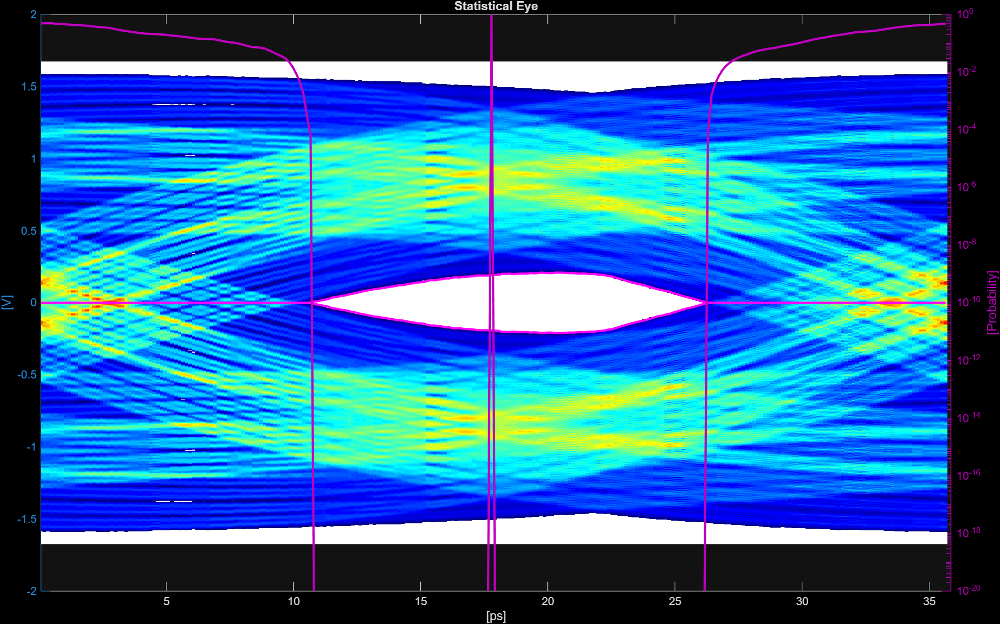

# Optimize SerDes Equalization with AI Agents

This example compares a flat agent with a taskmaster router over the same SerDes workflow. The flat agent sees the graph's 14 tools at once and decides their order. The taskmaster gives four specialized agents different roles; its router selects a target node, and the graph runs that node and its prerequisites. Both demos aim to optimize equalization and produce a statistical eye diagram.

**SerDes** (Serializer/Deserializer) links are high-speed interconnects used by interfaces such as PCIe, USB, Ethernet, and DDR. At multi-gigabit data rates, the channel distorts signals, so designers use equalization (CTLE, FFE, DFE) to compensate for loss. This workflow configures a channel, runs signal-integrity analysis, optimizes equalizer parameters, and checks the resulting eye diagram. For background, see [Surrogate Optimization and Scripting for SerDes System Design](https://www.mathworks.com/help/serdes/ug/surrogate-optimization-and-scripting-for-serdes-system-design.html).



## Requirements

- MATLAB R2025a or later; the AMI export tools require R2026a or later.
- SerDes Toolbox for the SerDes tools.
- Signal Integrity Toolbox for the `optimize` tool's `gaSI` call.
- The AI Agent SDK and an LLM endpoint; see the [main setup instructions](../../README.md#setup).

## Run

From the repository root, run either script. Each adds its example folder and `+agentgraph` parent to the MATLAB path.

```matlab
run agentGallery/taskmaster/examples/serdes/runDemoFlatAgent.m
run agentGallery/taskmaster/examples/serdes/runDemoTaskmaster.m
```

The flat agent chooses its own tool sequence. The taskmaster routes to the last graph node needed for the request; the graph then runs that node and its dependencies. The taskmaster demo also shows a live plot of graph progress. For cache reuse and reruns, see [Run and rerun](../../README.md#run-and-rerun).

## Tools

The `tools/` folder has 19 tool functions:

| Purpose | Tools |
| --- | --- |
| System setup | `createSerdesSystem`, `configureChannel`, `configureAnalogModel` |
| Equalization | `configureCTLE`, `configureFFE`, `configureDFECDR`, `configureVGA` |
| Analysis | `runAnalysis`, `getAnalysisResults`, `generateStimulus`, `equalizeWaveform`, `measureWaveform` |
| Optimization | `sweepParameter`, `optimizeWithGA` |
| Visualization | `plotSerdesResults`, `plotSweepResults` |
| Export | `exportToSimulink`, `exportAMI`, `getSystemState` |

Each tool follows `[observation, workspace] = toolName(workspace, ...)`. The workspace struct carries application state between tools.

To add or replace a tool, add a `.m` file with that signature to `tools/`. `createSerdesTools.m` discovers `.m` files there and registers supported ones as `aisdk.LLMTool` objects. Configure each node's agent and its selected tools in `rxSignoffGraphDefinition.m`, then pass that agent to `AgentNode`.
