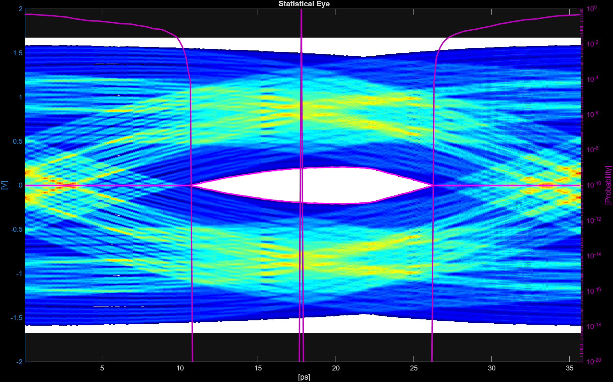

# Optimize SerDes Equalization with AI Agents

### Why graph-based AI agents?

An AI agent is an LLM that can reason and call external tools. The simplest architecture hands the agent every tool at once (a "flat" tool set). Agents can handle repetitive multi-step workflows autonomously, but those with a flat tool set may call tools out of order or skip steps. Encoding the workflow into a graph constrains *what* is allowed to happen and in *what order* — giving you the productivity of an agent with the determinism of a script.

This demo explores three levels of graph-based agent autonomy:

1. **Flat Agent** — A single `AIAgent` with a single "flat" array of tools, with a simple agent loop that figures out the workflow on its own.
2. **Agent Graph** — Four specialized agents, implemented as an `AgentNode` execute in fixed dependency order via a `ToposortEngine`. Each agent sees only the tools it needs. The execution order is deterministic and defined by the graph edges.
3. **Taskmaster** — Same Agent Graph, but an LLM orchestrator (the Taskmaster) sits above it. The Taskmaster has one tool — `runToGoal(goalNode)` — which runs the goal node and all its ancestors.

### The SerDes task

**SerDes** (Serializer/Deserializer) links are the high-speed interconnects inside every modern chip-to-chip interface — PCIe, USB, Ethernet, DDR. At multi-gigabit data rates, the physical channel distorts signals, so designers add equalization (CTLE, FFE, DFE) to compensate for signal loss. The design task is to configure the channel model, choose equalizer parameters, run signal-integrity analysis, and iterate until the opening of the eye diagram meets spec. For background on the scripting workflow this demo automates, see [Surrogate Optimization and Scripting for SerDes System Design](https://www.mathworks.com/help/serdes/ug/surrogate-optimization-and-scripting-for-serdes-system-design.html).



## Requirements

To run this example, you need:

- MATLAB R2025a or later (R2026a+ required for AMI export tools)
- Signal Integrity Toolbox
- AI Agent SDK (`+aisdk` on the MATLAB path)
- Access to an LLM endpoint (default: OpenAI `gpt-4.1-mini`)

## Setup

The AI Agent SDK connects to OpenAI by default. Set the `OPENAI_API_KEY` environment variable or save it to a `.env` file on the MATLAB path.

To use a different provider, change the `LLMClient` constructor in `runDemoFlatAgent.m` (or whichever demo script you are running):

```matlab
client = aisdk.LLMClient("ollama","qwen2.5:32b");
```

## Run Example

Navigate to the demo directory before running:

```matlab
>> cd demos/serdes
```

There are three ways to run this example:

**Flat agent:** A single agent with all tools figures out the order on its own.

```matlab
>> run runDemoFlatAgent.m
```

**Agent graph:** Four specialized agents — build, analyse, optimize, plot — execute in dependency order via a fixed graph traversal.

```matlab
>> run runDemoAgentGraph.m
```

**Taskmaster:** Same graph, but the Taskmaster agent decides which goal node to drive and can re-iterate until metrics are met.

```matlab
>> run runDemoTaskmaster.m
```

All target the same outcome: optimal equalization and a statistical eye diagram. The graph demos add live observability (a GUI showing node progress) and restrict each agent to only the tools it needs.

### Key files

| File                    | Purpose                                                                          |
| ----------------------- | -------------------------------------------------------------------------------- |
| `runDemoFlatAgent.m`  | Single-agent demo script                                                         |
| `runDemoAgentGraph.m` | Fixed graph traversal (toposort, no orchestrator)                                |
| `runDemoTaskmaster.m` | Graph + LLM Taskmaster orchestration                                             |
| `createSerdesTools.m` | Tool array factory (shared across all demos)                                     |
| `tools/`              | Individual tool wrapper functions                                                |
| `graphConfig.m`       | Graph node definitions, edges, and per-node prompts                              |
| `+agentgraph/`        | Domain-agnostic graph framework — see[Architecture](+agentgraph/ARCHITECTURE.md) |

## Tools

The `tools/` directory contains 19 self-contained tool functions covering the full SerDes workflow:

- **System setup** — `createSerdesSystem`, `configureChannel`, `configureAnalogModel`
- **Equalization** — `configureCTLE`, `configureFFE`, `configureDFECDR`, `configureVGA`
- **Analysis** — `runAnalysis`, `getAnalysisResults`, `generateStimulus`, `equalizeWaveform`, `measureWaveform`
- **Optimization** — `sweepParameter`, `optimizeWithGA`
- **Visualization** — `plotSerdesResults`, `plotSweepResults`
- **Export** — `exportToSimulink`, `exportAMI`, `getSystemState`

Each tool follows the same signature: `[observation, workspace] = toolName(workspace, ...)`. The workspace struct threads state between tools.

### Swapping in your own tools

To add or replace tools, drop a `.m` file into `tools/` with the standard signature. `createSerdesTools` auto-discovers all `.m` files in that directory and registers them as `aisdk.LLMTool` objects. To restrict which tools a graph node sees, set `ToolNames` on the `AgentNode` in `graphConfig.m`.

## Issues

If you find bugs or unexpected behavior in the demo or tools, please open an issue.

## See Also

[+agentgraph Architecture](+agentgraph/ARCHITECTURE.md) | [aisdk.AIAgent](../../+aisdk/AIAgent.m) | [aisdk.LLMTool](../../+aisdk/LLMTool.m) | [aisdk.LLMClient](../../+aisdk/LLMClient.m)

*Copyright 2026 The MathWorks, Inc.*
