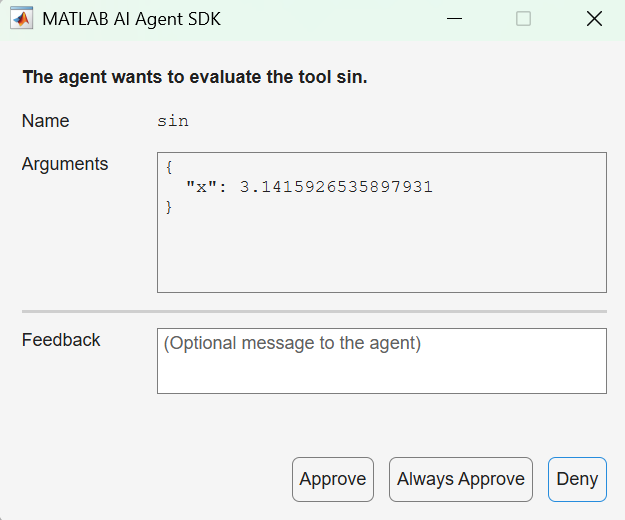

# resetApproval
<a id="resetapproval"></a>

Reset approval status of agentic tools
## Syntax
<a id="syntax"></a>

`resetApproval(agent)`

`resetApproval(agent,toolNames)`
## Description
<a id="description"></a>

When you permanently approve a tool, for example by selecting Always
Approve in the default tool approval dialog, the agent can then call the same
tool without additional human approval for the remainder of the agent session. Use the
`resetApproval` function to revoke the permanent approval and force the
agent to request human approval again the next time it tries to call the tool.

`resetApproval(agent)` resets the approval
status of each tool of the AI agent `agent` whose `ApprovalRequest` property is `"once"`. The
software removes all tools from the `UserApprovedTools` property of the
agent.

`resetApproval(agent,toolNames)`
resets the approval status for the tools `toolNames`. The software
removes those tools from the `UserApprovedTools` property of the
agent.
## Examples
<a id="examples"></a>
### Reset Tool Approval
<a id="reset-tool-approval"></a>

This example shows how to inspect and reset the list of approved
tools of an agent.

Create an LLM tool based on the sine function. Set the
`ApprovalRequest` property of the tool to
`"once"`.

```
tool = aisdk.LLMTool(@sin,InputArguments=struct(x=pi),OutputArguments=struct(y=0));
tool.ApprovalRequest = "once";
```

Create an agent from an LLM client `client` and add the
tool.

```
agent = aisdk.AIAgent(client,Tools=tool);
```

Run the agent. Trigger a tool call by asking the agent to calculate the sine of
pi.

```
run(agent,"Calculate the sine of pi.");
```
The software opens a dialog window, requesting approval for calling the tool.



Select **Always Approve**.
```
[think]
[call function sin with inputs {"x":3.1415926535897931}]
[function return] {"y":1.2246467991473532E-16}
[think]
The sine of pi (π) is approximately 1.2246467991473532 × 10⁻¹⁶, which is effectively zero.

```

Inspect the list of approved tools.

```
agent.UserApprovedTools
```

```
ans =

    "sin"
```

Reset the approval status of the agent's tools.

```
resetApproval(agent);
```

Inspect the list of approved tools again.

```
agent.UserApprovedTools
```

```
ans =

  1×0 empty string array
```
## Input Arguments
<a id="input-arguments"></a>
### `agent` — AI agent
<a id="agent"></a>

`aisdk.AIAgent` object

AI agent, specified as an [`aisdk.AIAgent`](aisdk.AIAgent.md) object.
### `toolNames` — Names of tools to reset
<a id="toolnames"></a>

string scalar | string vector

Names of tools to reset, specified as a string scalar or string vector.

Data Types: `string`
## See Also
<a id="see-also"></a>

[`aisdk.AIAgent`](aisdk.AIAgent.md)

*Copyright 2026 The MathWorks, Inc.*

